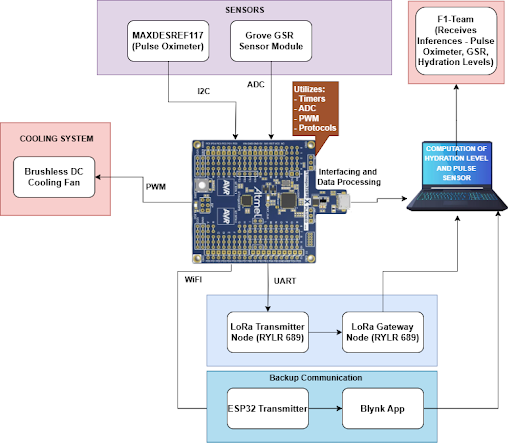
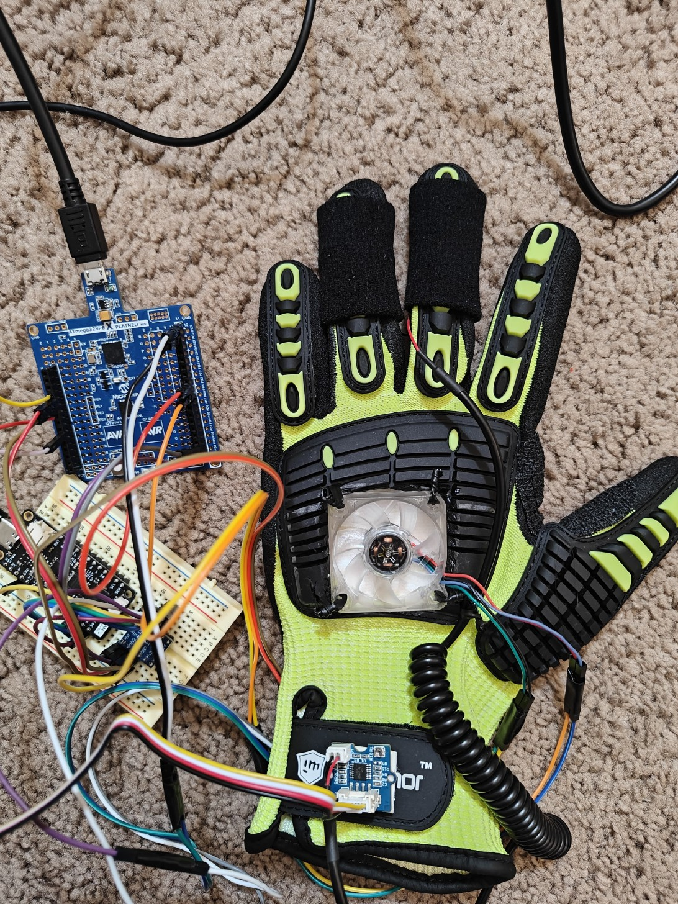
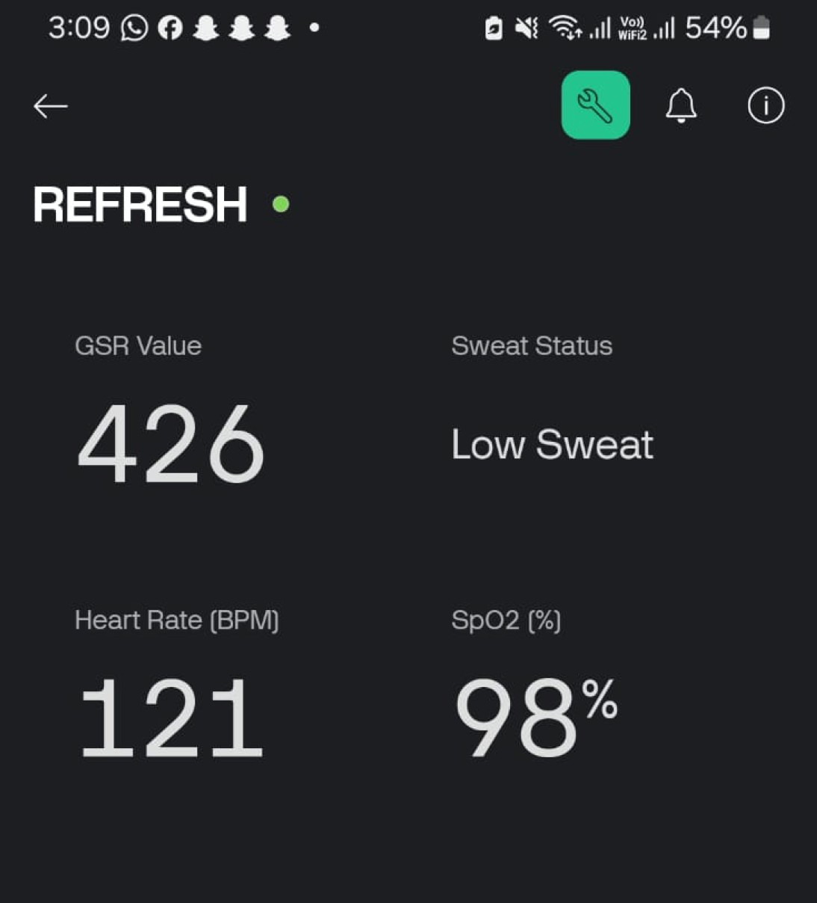
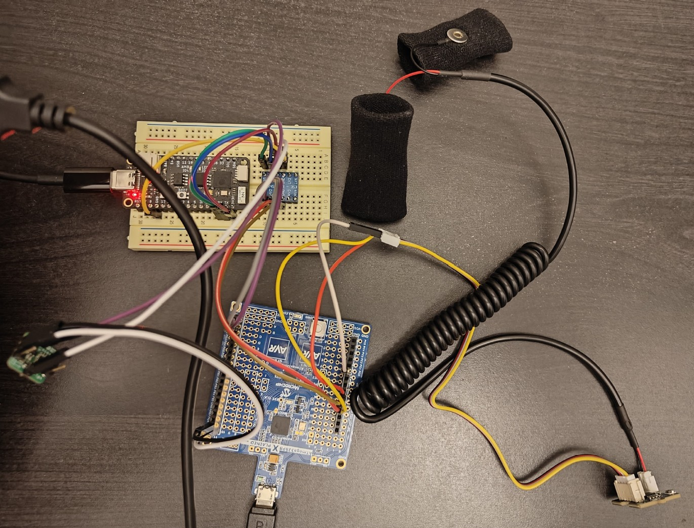
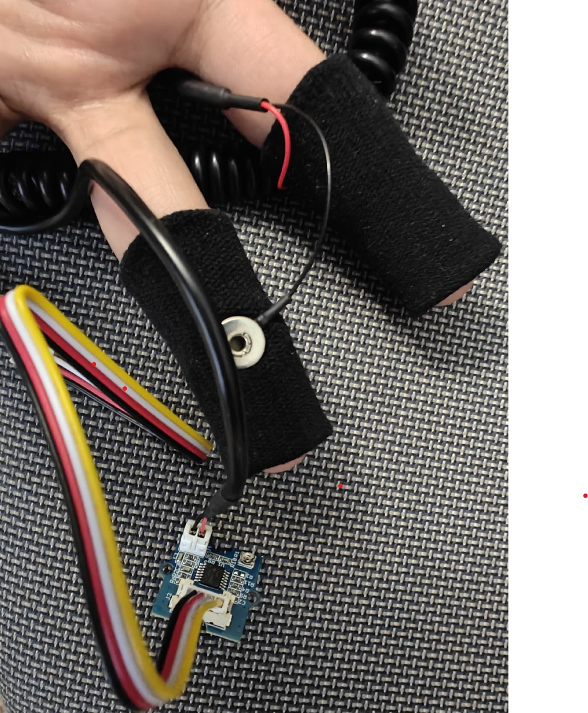
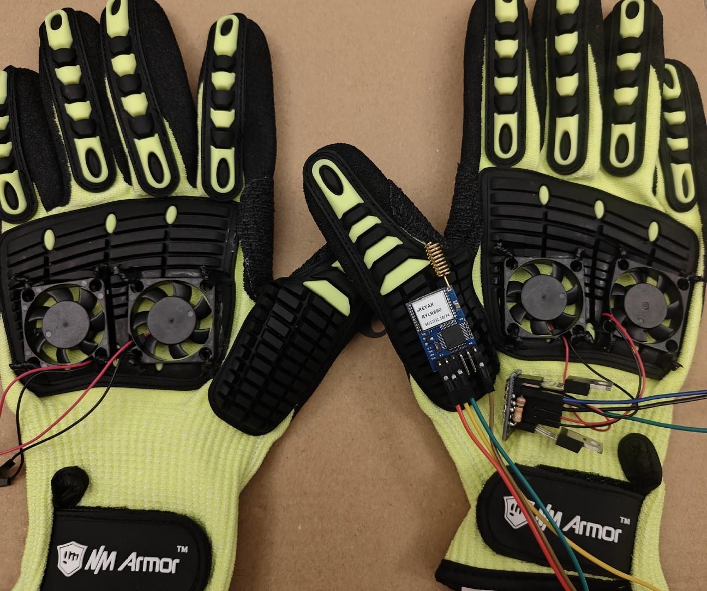
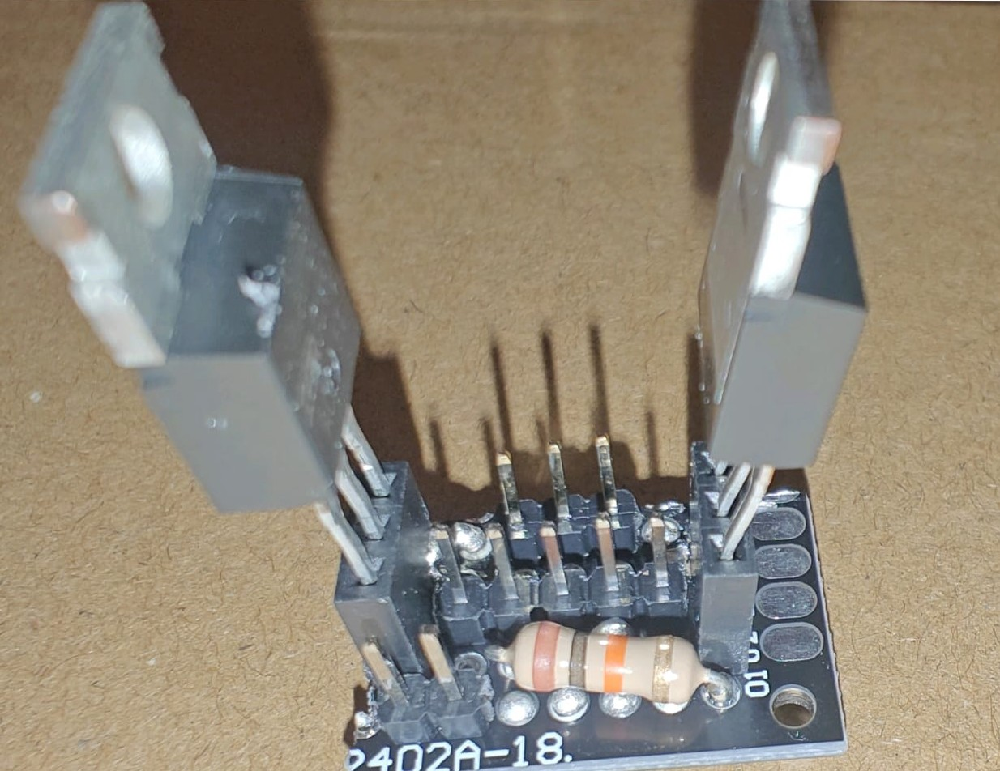
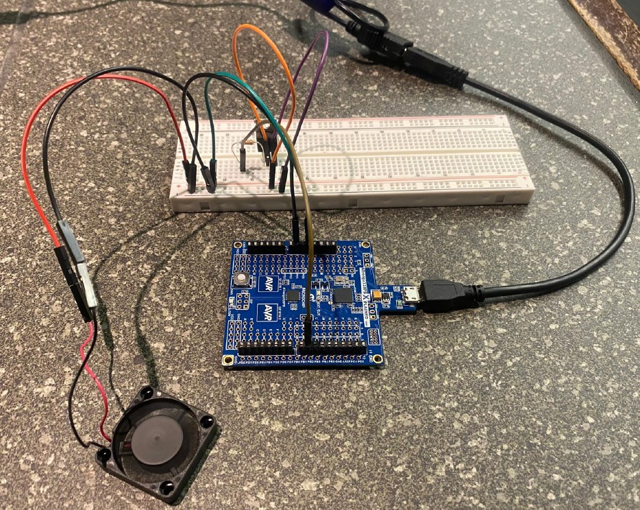

## **Welcome to R.E.F.R.E.S.H**

## Table of Contents
- [Home](#welcome-to-refresh)
- [About](#about-the-project)
- [Design](#design)
- [Software](#software-requirements-specification-srs)
- [Results](#results)
- [Testing](#testing-and-challenges)

### **Revolutionizing Formula 1 Driver Safety and Performance**

**R.E.F.R.E.S.H (Racing Equipment for Fluid Regulation and Enhanced Sweat Handling)** is an innovative wearable glove system designed to improve the safety and efficiency of Formula 1 drivers. By integrating advanced sensor technology, real-time health monitoring, and efficient cooling mechanisms, this project addresses the unique challenges of high-performance racing.

## **About the Project**

### **Background**

Formula 1 drivers endure extreme physical and environmental stress during races, often experiencing dehydration, overheating, and cognitive fatigue. These conditions compromise their performance and safety.
R.E.F.R.E.S.H tackles these challenges with:
- Real-time monitoring of hydration, pulse, and SpO₂ levels.
- Dynamic cooling systems for temperature regulation.
- Reliable data transmission using LoRa technology for remote health management.

### **Our Goal**

#### Our project has the following objectives:

- Hydration Monitoring: Provide real-time feedback on hydration levels using GSR data, processed through a machine learning model.
- Vital Sign Tracking: Monitor heart rate and oxygen saturation with precision.
- Dynamic Cooling: Automatically adjust cooling intensity based on hydration levels.
- Reliable Communication: Ensure seamless data transmission using LoRa and a backup ESP32 system.

## **Design**

### **Hardware Requirements Specification (HRS)**

The hardware requirements focus on modularity, precision, and performance. Key specifications include:
- Microcontroller: ***ATmega328PB*** for sensor integration and control logic.
- Sensors:
    - ***MAX30102 Pulse Oximeter*** for SpO₂ and heart rate.
    - Grove ***GSR Sensor*** for hydration monitoring.
- Cooling System: PWM-controlled ***DC fan*** for temperature regulation.

### **HRS Results**

- The ATmega328PB successfully integrated with all sensors.
- The PWM-controlled fan system was tested at different hydration states, demonstrating seamless speed adjustments.

| **Requirement No.** | **Test Method**                                                                                                                | **Result** |
|----------------------|----------------------------------------------------------------------------------------------------------------------------------|------------|
| **HRS 01**           | The project uses the ATmega328PB microcontroller as the central unit, successfully tested with basic I/O operations.             | Pass       |
| **HRS 02**           | The GSR sensor measures skin resistance and hydration levels, with data successfully read by the ADC of the microcontroller.    | Pass       |
| **HRS 03**           | The pulse oximeter (MAXDESREF117) measures SpO₂ and heart rate with the I2C protocol, data accurately transmitted to the MCU.    | Pass       |
| **HRS 04**           | LoRa modules (RYLR896) enable data transmission over long distances, interfacing with the MCU via UART.                         | Blocked       |
| **HRS 05**           | The cooling subsystem consists of PWM-controlled fans, adjusting speed dynamically based on GSR sensor hydration data.         | Pass       |
| **HRS 06**           | If we fail to achieve LoRa transmission, we will shift the system to use ESP32 for communication, sending data to Blynk over Wi-Fi.           | Blocked       |


### **Software Requirements Specification (SRS)**

The software design supports data acquisition, real-time processing, and machine learning integration. Key specifications include:
- Sensor Data Acquisition:
    - ***I2C*** for pulse oximeter data.
    - ***ADC*** for GSR sensor readings.
- Control Logic:
    - A ***Random Tree Classifier*** classifies hydration levels ("Hydrated," "Medium Hydration," "Dehydrated") based on GSR data.
    - Fan speed dynamically adjusts using ***Timer1*** in ***Fast PWM mode***.
- Communication Module:
    - ***ESP32*** transmits data to the ***Blynk*** app for real-time monitoring.

### **SRS Results**

- GSR data updated hydration levels every second.
- The ML model achieved 98% accuracy in classifying hydration levels.
- Data transmission via ESP32 was reliable, with all sensor data visualized on the Blynk platform in real-time.

| **Requirement No.** | **Test Method**                                                                                                                                               | **Result** |
|----------------------|----------------------------------------------------------------------------------------------------------------------------------------------------------------|------------|
| **SRS 01**           | The device successfully monitored and logged GSR values, updating hydration levels every second using predefined thresholds.                                    | Pass       |
| **SRS 02**           | The MAXREFDES117 sensor measured SpO₂ and heart rate with a precision of ±3%, updating readings every second.                                                   | Pass       |
| **SRS 03**           | The device successfully transmitted sensor data via LoRa to a remote monitoring system at intervals of 5 seconds. LoRa communication showed minimal latency.       | Blocked       |
| **SRS 04**           | Utilizing ESP32 for backup communication and sends data to Blynk over Wi-Fi.                                           | Blocked       |
| **SRS 05**           | The cooling subsystem dynamically adjusted fan speed using PWM control based on hydration thresholds from GSR sensor readings.                                  | Pass       |
| **SRS 06**           | Machine learning algorithms, specifically Random Tree Classifier, were used to analyze GSR data and classify hydration levels, controlling the cooling system.     | Pass       |

### **Flow Diagram**

<div align="center">
  
  <p><i>Fig1: Block Diagram of the Prototype</i></p>
</div>

The F1 Cooling Glove is a sophisticated system comprising a custom processing board, sensors, a cooling mechanism, and communication modules. Each component works in unison to monitor the driver’s physiological state and regulate cooling based on real-time data. Below is a detailed summary of the block diagram’s functionality:

**Core Processing Board**
- The custom processing board, built around the ATmega328PB microcontroller, serves as the central hub for integrating and coordinating the system’s components.
- It handles data acquisition, processing, and communication using built-in peripherals like timers, ADC (Analog-to-Digital Converter), PWM (Pulse Width Modulation), and I2C communication protocols.
- The processing board supports:
    - I2C communication to interface with digital sensors.
    - ADC inputs to handle analog signals, such as those from the GSR sensor.
    - PWM outputs to control the fan speed dynamically based on hydration levels.

**Key Sensors**
1. MAXREFDES117 Pulse Oximeter:
    - Embedded within the glove to monitor the driver’s blood oxygen saturation (SpO₂) and heart rate in real time.
    - Connects to the processing board via I2C for efficient and accurate data transfer.
2. Grove GSR Sensor Module:
    - Measures the driver’s galvanic skin response (GSR), which provides insights into hydration and stress levels.
    - Outputs analog signals processed by the microcontroller’s ADC to classify hydration levels using thresholds or machine learning algorithms.

**Cooling Mechanism**
- A brushless DC cooling fan ensures the driver’s hand remains cool during intense racing conditions.
- The initial prototype's fan is controlled via a MOSFET switching system, enabling precise speed modulation based on real-time GSR data.
- The final prototype used a 3-pin connector fan where it's PWM pin was controlled by signals generated by the ATmega328PB and the fan speed was adjusted dynamically to maintain comfort while reducing unnecessary power consumption.

**Data Transmission**
1. Primary Communication (ESP32 and Blynk):
    - An ESP32 module serves as the primary communication interface, transmitting biometric and hydration data to the Blynk app.
    - The Blynk platform allows real-time visualization of the driver’s physiological metrics, such as SpO₂, heart rate, and hydration levels, ensuring that the F1 team can monitor the driver's state continuously.

2. Secondary Communication (LoRa):
    - A backup communication system using LoRa modules provides long-range data transmission for redundancy.
    - Ensures uninterrupted monitoring in case of Wi-Fi connectivity issues.

**Machine Learning Integration**
- The GSR data is processed using a machine learning model embedded in the processing board.
- A Random Tree Classifier categorizes hydration levels into:
    - Hydrated
    - Medium Hydration
    - Dehydrated
The hydration classification guides fan speed adjustments and provides real-time feedback to the F1 team.

**System Workflow**
- Sensors collect physiological data (SpO₂, heart rate, and GSR).
- The processing board aggregates and analyzes data, applying machine learning models for hydration classification.
- Based on hydration levels, PWM signals adjust fan speeds dynamically.
- Processed data is transmitted via ESP32 to the Blynk app and through LoRa for redundancy.
- The Blynk app provides real-time visualization of the driver’s physiological state.

## Firmware implementation, Application logic and Critical drivers

#### Application Logic:

**1. Sensor Data Acquisition:**

- The GSR Sensor measures skin resistance to monitor hydration levels. The raw data is read via the ADC of the ATmega328PB microcontroller, and the average resistance is calculated over multiple readings to smooth out fluctuations.

- The MAX30102 pulse oximeter measures SpO₂ and heart rate. The sensor communicates with the microcontroller via I2C, and the data is processed to provide real-time health metrics.

**2. Cooling System Control:**

The cooling system consists of PWM-controlled fans. The fan speed is dynamically adjusted based on the GSR data. If the skin resistance is low (indicating high sweat levels), the fan speed increases, providing cooling. The fan speed is controlled by varying the PWM duty cycle, which is managed by the microcontroller's Timer1 module.

**3. Data Transmission:**

The data from the sensors is transmitted to a remote system using LoRa modules (RYLR896). We also are implementing the ESP32 as a backup to send data to the Blynk platform over Wi-Fi. The system attempts to send data every 5 seconds.

#### Critical Drivers:

**1. ADC Driver (GSR Sensor):** {[GSR Sensor Test Code](Grove_gsrTest.X)}

The GSR sensor measures skin resistance, which correlates with hydration levels. This sensor provides an analog voltage signal, which the microcontroller reads using its Analog-to-Digital Converter (ADC). The driver configures the ADC to read values from the GSR sensor, processes them, and calculates hydration levels.

- The ADC needs to be initialized before any readings are taken. The ADC is set to use AVcc as the reference voltage and the prescaler is configured to ensure that the ADC clock is within the required frequency range.

- The ADC_Read() function selects the appropriate ADC channel, starts the conversion, and waits for the result. Once the conversion is complete, it returns the ADC value.

```c
// ADC initialization and read function
void ADC_Init() {
    ADMUX = (1<<REFS0);  // Set Vref=AVcc (assuming 5V reference voltage)
    ADCSRA = (1<<ADEN) | (1<<ADPS2) | (1<<ADPS1) | (1<<ADPS0); // Enable ADC and set prescaler to 128
}

// Function to read ADC value from a given channel
uint16_t ADC_Read(uint8_t channel) {
    ADMUX = (ADMUX & 0xF0) | (channel & 0x0F);  // Select ADC channel (bits 0-3)
    ADCSRA |= (1<<ADSC);  // Start conversion
    while (ADCSRA & (1<<ADSC));  // Wait for conversion to complete
    return ADC;  // Return the ADC result
}
```

**Explanation:**

- ADMUX: The ADMUX register selects the reference voltage and the input channel for the ADC. The GSR sensor is connected to one of the ADC input pins.

- ADCSRA: This register controls the ADC’s operation, enabling it and setting the prescaler.

- The ADC_Read() function initiates the ADC conversion and waits for it to finish, then returns the digital value.

**2. I2C (TWI) Driver (Pulse Oximeter - MAXDESREF117):** {[MAXDESREF117 Sensor Test Code](MAX30102_Pulse_Oximeter.X)}

The I2C (Inter-Integrated Circuit) protocol is used to communicate with the MAX30102 sensor. The microcontroller acts as the master device, and the MAX30102 acts as the slave device.

- The TWI_init() function configures the TWI (Two-Wire Interface) hardware module of the ATmega328PB microcontroller to communicate with other I2C devices. The SCL clock frequency is set to 100 kHz, and the prescaler is set to 1.

```c
void TWI_init(void) {
    TWSR0 = 0x00; // Prescaler = 1
    TWBR0 = ((F_CPU / SCL_CLOCK) - 16) / 2; // Set SCL frequency
    TWCR0 = (1 << TWEN); // Enable TWI
}
```

**Explanation:**

- TWSR0: TWI status register for prescaler configuration.
- TWBR0: TWI bit rate register, used to set the clock frequency.
- TWCR0: TWI control register, enabling TWI functionality.

The TWI_start() function sends the START condition on the I2C bus. The START condition signals the beginning of communication.

```c
uint8_t TWI_start(void) {
    TWCR0 = (1 << TWINT) | (1 << TWSTA) | (1 << TWEN); // Send START
    while (!(TWCR0 & (1 << TWINT)));                  // Wait for completion
    if (((TWSR0 & 0xF8) != TW_START) && ((TWSR0 & 0xF8) != TW_REP_START)) return 1;    // Check status
    return 0;
}
```
**Explanation:**

- TWSTA: Initiates the start condition.
- TWINT: Indicates if the TWI operation is complete.
- TWSR0: TWI status register to check the status of the communication.

The TWI_stop() function sends the STOP condition, marking the end of communication.

```c
void TWI_stop(void) {
    TWCR0 = (1 << TWINT) | (1 << TWSTO) | (1 << TWEN); // Send STOP
    while (TWCR0 & (1 << TWSTO));                     // Wait for completion
}
```
**Explanation:**

- TWSTO: Initiates the stop condition, signaling the end of the communication.

The TWI_write() function writes a byte of data to the slave device (MAX30102).

```c
uint8_t TWI_write(uint8_t data) {
    TWDR0 = data; // Load data
    TWCR0 = (1 << TWINT) | (1 << TWEN); // Start transmission
    while (!(TWCR0 & (1 << TWINT)));    // Wait for completion
    if ((TWSR0 & 0xF8) != TW_MT_DATA_ACK && (TWSR0 & 0xF8) != TW_MT_SLA_ACK && (TWSR0 & 0xF8) != TW_MR_SLA_ACK)
        return 1; // Check for ACK
    return 0;
}
```

**Explanation:**

- TWDR0: TWI data register used to load the byte to be transmitted.

- TWSR0: Status register to verify that the data was transmitted successfully.

The TWI_read_ack() function reads a byte of data from the slave device (MAX30102) and sends an ACK (Acknowledgment) to continue reading, while TWI_read_nack() reads data and sends a NACK (No Acknowledgment) to indicate the end of the read operation.

```c
uint8_t TWI_read_ack(void) {
    TWCR0 = (1 << TWINT) | (1 << TWEN) | (1 << TWEA); // Enable ACK
    while (!(TWCR0 & (1 << TWINT)));                 // Wait for completion
    return TWDR0;
}

uint8_t TWI_read_nack(void) {
    TWCR0 = (1 << TWINT) | (1 << TWEN); // Disable ACK
    while (!(TWCR0 & (1 << TWINT)));   // Wait for completion
    return TWDR0;
}
```
**Explanation:**

- TWEA: Enables the acknowledgment signal after each byte is received.

- TWDR0: Reads the data received from the slave.

The readFIFOData() function reads data from the FIFO_DATA register of the MAXDESREF117, which stores the raw Red and IR sensor values. The function reads six bytes of data (three for Red and three for IR) and combines them into 32-bit values.

```c
max30102_data_t readFIFOData(void) {
    max30102_data_t data = {0, 0};
    uint8_t temp[6]; // Temporary buffer for 6 bytes (3 bytes each for RED and IR)
    
    // Start reading from FIFO_DATA register
    TWI_start();
    TWI_write(MAX30102_WRITE_ADDR);
    TWI_write(0x07);  // FIFO_DATA register
    
    // Restart for reading
    TWI_start();
    TWI_write(MAX30102_READ_ADDR);
    
    // Read all 6 bytes
    temp[0] = TWI_read_ack(); // RED[23:16]
    temp[1] = TWI_read_ack(); // RED[15:8]
    temp[2] = TWI_read_ack(); // RED[7:0]
    temp[3] = TWI_read_ack(); // IR[23:16]
    temp[4] = TWI_read_ack(); // IR[15:8]
    temp[5] = TWI_read_nack(); // IR[7:0]
    
    TWI_stop();
    
    // Combine bytes into 32-bit values
    data.red = ((uint32_t)temp[0] << 16) | ((uint32_t)temp[1] << 8) | temp[2];
    data.ir = ((uint32_t)temp[3] << 16) | ((uint32_t)temp[4] << 8) | temp[5];
    
    return data;
}
```

**Explanation:**

- Reads 6 bytes of data from the FIFO register (3 bytes for the Red LED and 3 bytes for the IR LED).

- The data is then combined to form 32-bit values representing the Red and IR readings.

**3. PWM Driver (Cooling System)**

The cooling system uses PWM-controlled fans, and the fan speed is dynamically adjusted based on hydration data derived from the GSR sensor. The Timer1 is used to generate the PWM signal, and the duty cycle is adjusted based on the hydration level.

- The PWM_Init() function sets up Timer1 for Fast PWM mode.

- The Set_Fan_Speed() function adjusts the PWM duty cycle to control the fan speed based on the hydration level.

```c
// PWM initialization and control for fan speed
void PWM_Init() {
    DDRB |= (1 << PB1);  // Set PB1 (OC1A) as output for PWM signal
    TCCR1A |= (1 << WGM11); // Set Fast PWM mode
    TCCR1B |= (1 << WGM13) | (1 << WGM12);  // Fast PWM mode with ICR1 as top value
    TCCR1A |= (1 << COM1A1); // Non-inverting PWM on OC1A
    ICR1 = 639;  // Set the PWM frequency to approximately 1kHz
}

void Set_Fan_Speed(uint8_t speed) {
    OCR1A = (ICR1 + 1) * speed / 100 - 1;  // Set the PWM duty cycle based on the speed percentage
}
```
**Explanation:**

- PWM_Init() configures Timer1 to generate a PWM signal on pin PB1 (OC1A). The fan will respond to changes in the PWM duty cycle.

- The duty cycle is adjusted according to the hydration level, with a range from 0% (fan off) to 100% (fan at full speed) - Set_Fan_Speed().

4. UART Driver - For all sensors to send data {[LORA Test Code with UART](LoRa_Test.X)}

The LoRa module (RYLR896) is used for long-range data transmission. The UART driver enables communication between the microcontroller and LoRa, sending sensor data to a remote system.

- The UART_Init() function configures the UART communication with the LoRa module.

- The UART_Transmit() function sends a byte of data via UART.

```c
// UART initialization and LoRa communication
void UART0_init(unsigned int ubrr) {
    // Set baud rate
    UBRR0H = (unsigned char)(ubrr>>8);
    UBRR0L = (unsigned char)ubrr;
    
    // Enable transmitter and receiver
    UCSR0B = (1<<TXEN0) | (1<<RXEN0);
    
    // Set frame format: 8data, 1stop bit
    UCSR0C = (1<<USBS0)|(3<<UCSZ00);
}

void UART0_transmit(unsigned char data) {
    // Wait for empty transmit buffer
    while (!(UCSR0A & (1<<UDRE0)));
    
    // Put data into buffer, sends the data
    UDR0 = data;
}
```
**Explanation:**

- UART_Init() initializes the UART communication for the LoRa module, ensuring data can be transmitted at the specified baud rate.

- UART_Transmit() transmits a byte of data via UART to the LoRa module.

The firmware includes critical drivers for ADC, I2C, PWM, and UART communication, ensuring that the GSR sensor, pulse oximeter, cooling system, and LoRa module operate seamlessly. Each driver is modular, enabling independent testing and easy integration into the overall system. The application logic processes sensor data, controls the cooling system, and handles communication for real-time monitoring.  

## **Testing and Challenges**

- **Thermal Management**: The initial MOSFET-based fan design caused overheating, resolved by transitioning to direct PWM-controlled fans.
- **Sensor Calibration**: GSR sensor inaccuracies were addressed through extensive calibration, ensuring reliable hydration monitoring.
- **Communication Issues**: LoRa reliability concerns were mitigated by switching to ESP32, which enhanced data consistency and integration with Blynk.

## **Results**

- The final glove design effectively integrated all components, achieving its objectives of physiological monitoring and cooling.
- The fan system dynamically adjusted speeds based on hydration states, ensuring optimal performance.
- Data transmission via ESP32 was reliable, with all sensor data visualized on the Blynk platform in real-time.
- Machine learning accurately classified hydration levels, with a 98% success rate on test data.

## **Conclusion**

The REFRESH glove showcases a breakthrough in wearable technology for high-performance athletes. It combines precision monitoring, intelligent cooling, and robust communication, providing a holistic solution for Formula 1 drivers.

What We Would Do Differently:

- **Further Miniaturization**: Optimize hardware layout for a more compact and lightweight design.
- **Additional Sensors**: Integrate core body temperature and stress sensors for a more comprehensive physiological profile.
- **Advanced Data Analysis**: Implement cloud-based storage and analytics for long-term performance tracking.
- **Enhanced Communication**: Use BLE or 5G to improve scalability and reduce latency.

This system has potential applications in high-stress environments such as firefighting, military operations, and industrial safety, marking a significant step forward in wearable technology.

## **Media**

### **Video**

0:00 - Disclaimer  
0:04 - Video Starts  
0:12 - Thinking  
0:25 - News on F1  
0:33 - About the Idea (F1 cooling Glove)  
1:49 - Building the cooling glove (Megha, Sanskriti, Chirag - Team 20 timelapse)  
2:27 - Version 1 and 2 of our glove  
2:41 - GSR Data collection  
2:48 - Brief about our prototype  
4:25 - Demo of POC  
7:05 - End  

https://drive.google.com/file/d/1yyJiIGj5Hjy0Eqms6tbZzeYxR1msZSwT/view?usp=sharing


### **Gallery**

<figure>
  






<!-- <figcaption>AI-generated images that bring our vision of the product to life.</figcaption> -->
</figure>

## **Team**

### **Meet the Creators**

<figure>
  
</figure>

1. Chirag Satapathy
2. Sanskriti Binani
3. Megha Mistry

## **Acknowledgments**

We extend our gratitude to the University of Pennsylvania's ESE 5190 faculty and mentors for their guidance and support.
